<!-- TOC -->

- [Structure & Qualitative](#structure--qualitative)
    - [Circuit Configuration (CB, CE, CC)](#circuit-configuration-cb-ce-cc)
    - [Biasing Modes](#biasing-modes)
    - [Energy Band Diagram](#energy-band-diagram)
        - [Equilibrium (PNP)](#equilibrium-pnp)
        - [Equilibrium (NPN)](#equilibrium-npn)
        - [Active Mode Bias (PNP)](#active-mode-bias-pnp)
    - [Current Components: PNP Active](#current-components-pnp-active)
    - [Why can BJT amplify a signal?](#why-can-bjt-amplify-a-signal)
- [Calculations](#calculations)
    - [Base Width](#base-width)
    - [Emitter Efficiency (PNP)](#emitter-efficiency-pnp)
    - [Base Transport Factor (PNP)](#base-transport-factor-pnp)
    - [Common Base DC Current Gain](#common-base-dc-current-gain)
    - [Common Emitter DC Current Gain](#common-emitter-dc-current-gain)
- [Supplement](#supplement)
    - [Punch-through](#punch-through)
    - [Degenerate Doping](#degenerate-doping)
    - [Amplification](#amplification)
    - [Gamma](#gamma)
    - [Amplification Example](#amplification-example)
    - [Normal active node](#normal-active-node)
    - [How does control take place?](#how-does-control-take-place)

<!-- /TOC -->
# Structure & Qualitative
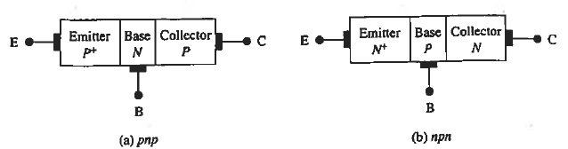 
Note that Emitter is more heavily doped than Collector. 
Usually Emitter Doping $\gg$ Base Doping > Collector Doping 
Base is narrow compared to a minority diffusion length. 
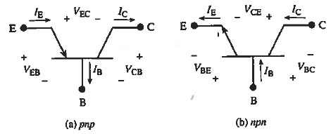 
> $$I_E=I_B+I_C$$
## Circuit Configuration (CB, CE, CC)
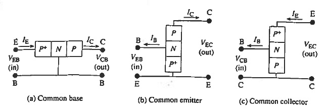
## Biasing Modes
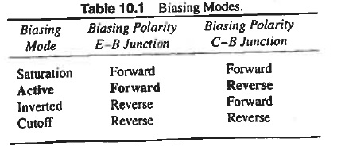
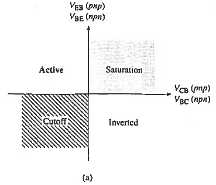
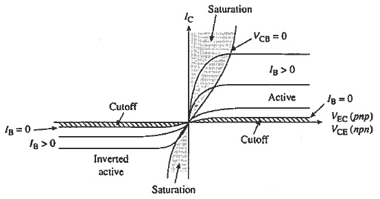
## Energy Band Diagram
### Equilibrium (PNP)
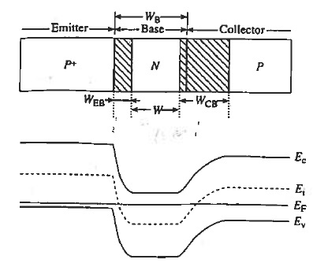 
Remark: Note that Emitter is more heavily doped -> higher energy && larger slope at depletion. For more graphs see p377 of textbook.
### Equilibrium (NPN)
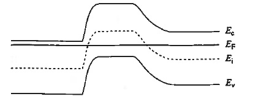 
### Active Mode Bias (PNP)
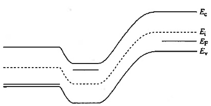 
Remarks: 
- Collector (Left) - Base (Middle) - Emitter (Right)
- E-B: forward bias, $E_{F,right}$ higher than $E_{F,middle}$
- C-B: reverse bias, $E_{F,left}$ lower than $E_{F,middle}$
## Current Components: PNP Active
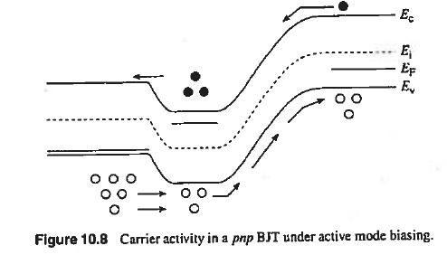 
- E-B Junction (Forward Bias)
    - Mainly hole injection from Emitter to Base
- B-C Junction (Reverse Bias)
    - The majority of injected holes diffuse through Base due to its narrow width. 
    - Accelerating field in B-C junction sweeps holes into Collector.
- Emitter acts as a source of carriers, Collector acts as a sink.

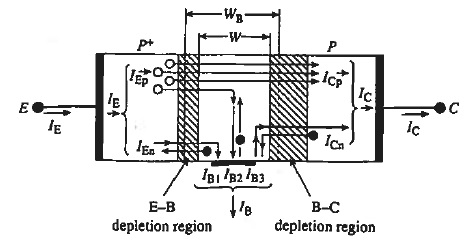 
> $$I_E = I_{Ep} + I_{En}$$
> $$I_C = I_{Cp} + I_{Cn}$$
$I_{En}$: Electron injection current from Base into Emitter. $I_{En} \ll I_{Ep}$ 
$I_{Cn}$: Minority carrier electrons in Collector wandering into the C-B depletion region. $I_{Cn}\ll I_{Cp}$
Therefore,
> $$I_{Cp}\approx I_{Ep}$$
> $$I_C\approx I_E$$
 
Base Current $I_B=I_E-I_C$ has three components:
- $I_{B1} = I_{En}$
- $I_{B2}$: Recombination with a small portion of injected holes.
- $I_{B3} = I_{Cn}$

All three components are small.
## Why can BJT amplify a signal?
When connected in common-emitter:
- Input Current: $I_B$
- Output Current: $I_C$
- Gain: $I_C/I_B$
# Calculations
## Base Width
> $$W = W_B - x_{nEB} - x_{nCB}$$
$W$: Non-depleted portion of Base 
$W_B$: Total width of Base 
$x_{nEB}$, $x_{nCB}$: n-type depletion of E-B, C-B junction.
## Emitter Efficiency (PNP)
Increasing $I_{Ep}$ while holding $I_E$ will decrease $I_{B1}=I_{En}$ and hence reduce $I_B$ and increase the overall current gain. 
Thinking $I_{Ep}$ as the useful Emitter output, the **Emitter Efficiency** is given by
> $$\gamma = \frac{I_{Ep}}{I_E} = \frac{I_{Ep}}{I_{Ep} + I_{En}}$$
## Base Transport Factor (PNP)
The fraction of minority carriers injected into the Base that successfully diffuse across the Base and enter the Collector.
> $$\alpha_T = \frac{I_{Cp}}{I_{Ep}}$$
## Common Base DC Current Gain
> $$I_C = \alpha_{dc}I_E + I_{CB0}$$
$I_{CB0}$: $I_C$ when $I_E=0$ 
$\alpha_{dc}$: Common Base DC Current Gain
> $$\alpha_{dc}=\gamma \alpha_T$$
> $$I_{CB0}=I_{Cn}$$
## Common Emitter DC Current Gain
> $$I_C=\beta_{dc}I_B+I_{CE0}$$
$I_{CE0}$: $I_C$ when $I_B=0$ 
$\beta_{dc}$: Common Emitter DC Current Gain
> $$\beta_{dc}=\frac{\alpha_{dc}}{1-\alpha_{dc}}$$
> $$\beta_{dc}\approx\frac{I_C}{I_B}$$

# Supplement
## Punch-through
Base width is too small that the whole base is depleted. Increases base resistance. 
If base width is too large, $I_B$ will increase.
## Degenerate Doping
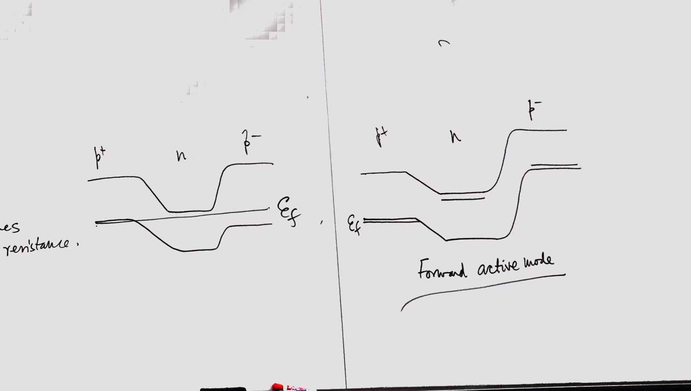
$E_F$ lower than $E_v$: degenerate doping

## Amplification
Small change in $I_B$ $\rightarrow$ large change in $I_C$
> $$\gamma=\frac{I_{Ep}}{I_{En}+I_{Ep}}$$
Keep $I_{En}$ small to achieve $\gamma\approx 1$, thus a high gain 
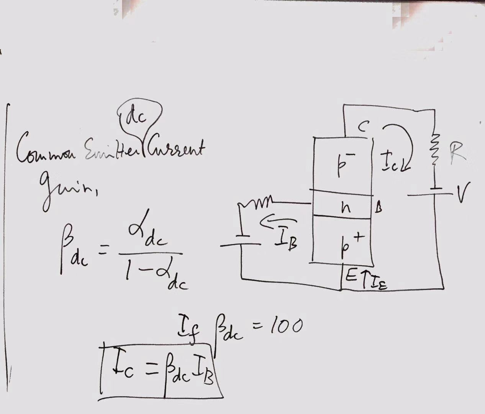 
$I_C$ is given by the gain, not the resistor, voltage source

## Gamma
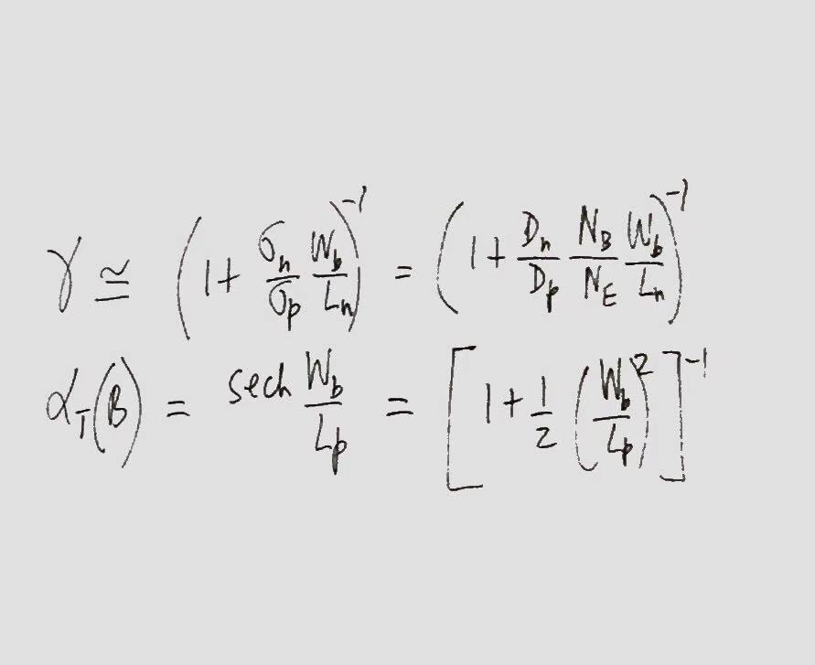

## Amplification Example
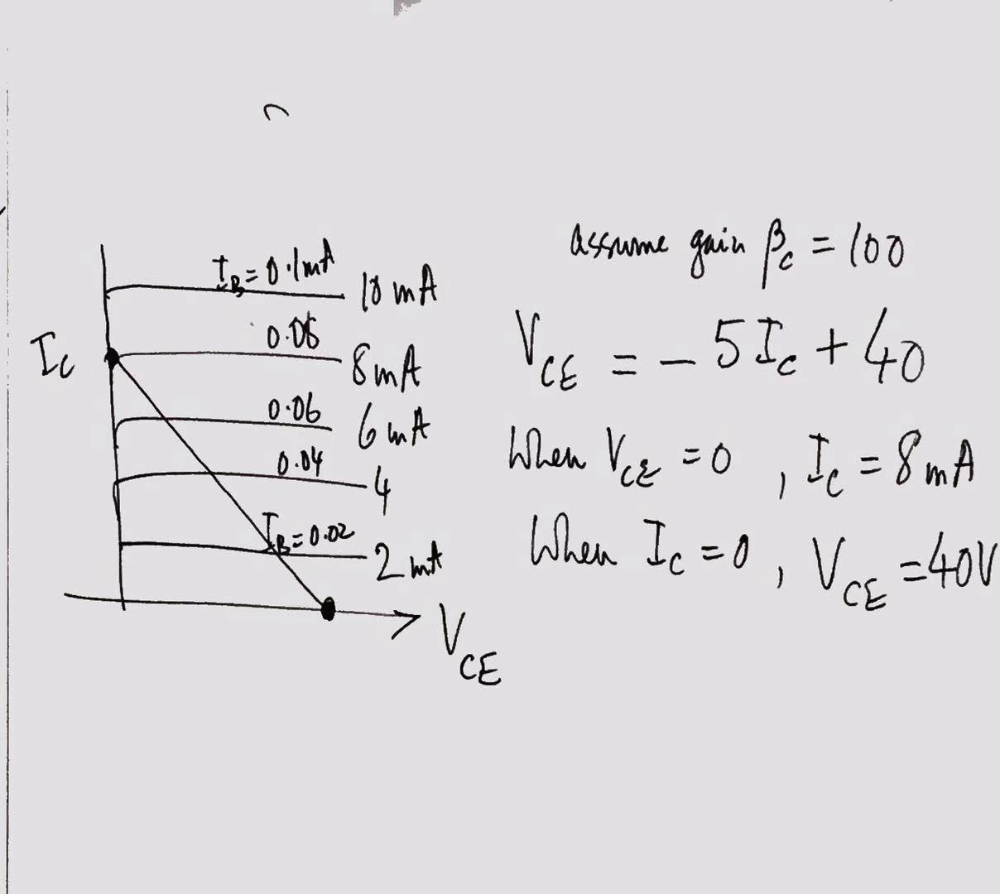
## Normal active node
$I_B$ is such that 
When operating point is between the two end points and emmiter junction is forward biased and collector junciton is reverse biased.

## How does control take place?
The goal is to let as much holes as possible to travel to collector. 
Holes are minority carrier in base. Travel by diffusion. 
How to accelerate? 
> $$\tau_{minor}\approx1ns$$
> $$t_{transit}\approx1ps$$
> $$gain\approx\frac{\tau_{minor}}{t_{transit}}$$

 Decrease the base current $\rightarrow$ excess holes in base $\rightarrow$ forward bias between $E-B$ junction decreases $\rightarrow$ $I_E$ decreases