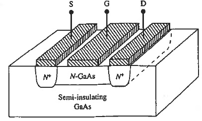
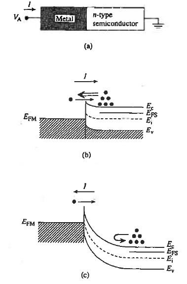

# FET
<!-- TOC -->

- [How FET got its Name](#how-fet-got-its-name)
- [JFET (Junction FET)](#jfet-junction-fet)
    - [I-V Characteristics](#i-v-characteristics)
        - [Questions](#questions)
    - [Pinch-off voltage](#pinch-off-voltage)
    - [Channel Current](#channel-current)
    - [Gain (Transconductance)](#gain-transconductance)
- [MESFET (Metal Semiconductor FET)](#mesfet-metal-semiconductor-fet)
    - [Metal-Semiconductor (MS) Contact](#metal-semiconductor-ms-contact)
    - [Schottky Diode](#schottky-diode)
    - [Heavily Doped (Degenerately Doped) Semiconductor](#heavily-doped-degenerately-doped-semiconductor)
    - [Schottky Diode Calculations](#schottky-diode-calculations)
- [MOSFET (Metal-Oxide FET)](#mosfet-metal-oxide-fet)
    - [Composition](#composition)
    - [Terminal Naming](#terminal-naming)
    - [Functionality (NMOS)](#functionality-nmos)
    - [MOS Energy Band Diagram](#mos-energy-band-diagram)
    - [MOS Calculations](#mos-calculations)
        - [$\PhiS$: Surface Potential](#\phis-surface-potential)
        - [$\PhiF$](#\phif)
        - [Depletion Width $W$](#depletion-width-w)
        - [Threshold Voltage $VT$](#threshold-voltage-vt)
        - [Cap-Voltage Characteristics](#cap-voltage-characteristics)
    - [Supplement](#supplement)
    - [JFET pinch-off](#jfet-pinch-off)
        - [Why doesn't current goto 0](#why-doesnt-current-goto-0)
        - [How does current flow after pinch-off](#how-does-current-flow-after-pinch-off)
    - [Gradual Channel Approx](#gradual-channel-approx)
    - [JFET Transconductance](#jfet-transconductance)

<!-- /TOC -->
# How FET got its Name
A voltage applied to the metallic plate modalated the conductance of the underlying semiconductor, which in turn modulated the carrent flowing between ohmic contacts A and B. This phenomenon, where the conductivity of a semiconductor is modulated by an electric field applied normal to the surface of the semiconductor, has been named the field effect.
# JFET (Junction FET)
 
Suppose we connect **S** to ground, reverse bias at **S** is $V_G$. 
## I-V Characteristics
1. $V_G$ = 0. When VD is small, ID is small. Linear I-V. No change in depletion width across channel. 
 
 
2. $V_G$ increases. Channel pinches-off. 
 
 
 
### Questions
1. Should/Should not $I_D$ = 0 beyond pinch-off? 
No. Carriers can also pass depletion region, but see a much higher resisitance.
2. Why does $V_D$ > $V_D^{Sat}$ have no effect on ID? 
Increasing $V_D$ will also increase the length of pinched-off region. These two effects cancel out.
## Pinch-off voltage
$V_p$ = Reverse bias between n-channel and $p^+$ gate at the drain end $(x=0)$. 
$h(x)$ = Channel half-width at any $x$ 
$a$ = half width of channel 
Assumptions:
1. Channel with at $x=0$ decreases uniformly as the reverse bias increases to pinch-off.
2. $V_{bi}$ neglected.
3. $p^+-n$ gate junction.

> $$V_p=\frac{qa^2N_D}{2\varepsilon}$$
$a$: half thickness
## Channel Current
$L$: length 
$Z$: depth 
$2a$: thickness
> $$I_D=G_oV_P\left[\frac{V_D}{V_P} + \frac23\left(-\frac{V_G}{V_P}\right)^{3/2} - \frac23\left(\frac{V_D-V_G}{V_P}\right)^{3/2}\right]$$
> $$G_o=\frac{2aZ}{\rho L}$$
> $$I_D(sat)=G_oV_P\left[\frac{V_D}{V_P} + \frac23\left(-\frac{V_G}{V_P}\right)^{3/2} - \frac23\right]$$
## Gain (Transconductance)
> $$g_m(sat)=\frac{\partial I_D(sat)}{\partial V_G}=G_o\left[1-\left(-\frac{V_G}{V_P}\right)^{1/2}\right]$$
# MESFET (Metal Semiconductor FET)

## Metal-Semiconductor (MS) Contact

Energy Band Diagram of Metal and Semiconductor

- $\Phi_M$: Metal Work Function (the one in photoelectric effect)
- $\Phi_S$: Semiconductor Work Function
- $\chi$: Electron Affinity. $\chi=(E_0-E_C)|_{surface}$

$$\Phi_S=\chi+(E_c-E_F)_{FB}$$
- $(E_c-E_F)_{FB}$: Energy difference between $E_c$ and $E_F$ at flat band (i.e.) zero bias condition. 

$$\Phi_B=\Phi_M-\chi$$
- $\Phi_B$: surface potential-energy barrier encountered by electrons with $E=E_F$ in the metal.
## Schottky Diode
- $\Phi_M>\Phi_S$: Applying $V_A>0$ lowers $E_{FM}$ below $E_{FS}$, reduces the barrier seen by electrons in the semiconductor. 

- $\Phi_M<\Phi_S$: Non-rectifying, Ohmic.

## Heavily Doped (Degenerately Doped) Semiconductor

When the barrier is thin enough, the carriers can tunnel through. 
Upper: forward bias. Below: rev bias 
Additional component of current
## Schottky Diode Calculations
- Built-in Voltage

$$V_{bi}=\frac1q\left[\Phi_B-(E_c-E_F)_{FB}\right]$$
- $\rho$
    - Metal: delta function (charge only on surface)
    - Semiconductor: $\rho=qN_D$
- $E$:
> $$E(x)=-\frac{qN_D}{\varepsilon_{Si}}(W-x)\ldots 0\le x\le W$$
- $V$:
> $$V(x)=-\frac{qN_D}{2\varepsilon_{Si}}(W-x)^2\ldots 0\le x \le W$$
- Depletion Width
> $$W=\sqrt{\frac{2\varepsilon_{Si}}{qN_D}(V_{bi}-V_A)}$$
- $\Phi(x)$
> $$\Phi(x)=\frac{qN_Dx^2}{2\epsilon_S}$$
- Current Density
> $$J=J_S(e^{qV_a/kT}-1)$$
> $$J_S=A^*T^2\exp\left(-\frac{q\Phi_B}{kT}\right)$$
$A^*$ is the Effective Richardson Constant  
# MOSFET (Metal-Oxide FET)
## Composition
- MOS Capacitor
- Two pn juncitons
## Terminal Naming
- Carriers enter the structure through Source (S)
- Leave through the Drain (D)
- Subject to the control of the Gate (G)
## Functionality (NMOS)
- When $V_G\le V_T$, i.e. $V_G$ is in accumulation or depletion biased, the gated region contains mostly holes and few electrons, an open circuit is formed.
- When $V_G>V_T$, i.e. $V_G$ is inversion biased, an inversion layer (channel) containing mobile electrons is formed.
- As $V_D$ increases, the channel finally pinches-off, the current saturates. 

MOSFET Pinches-off

Channel Length Modulation of Short-Channel Device

## MOS Energy Band Diagram

Band Diagram for NMOS

- Accumulation ($V_G<0$) holes accumulate on the semiconductor side of the gate
- Depletion ($0<V_G<V_T$) holes repelled away, leaving Ionized acceptors atoms
- Inversion ($V_G>V_T$) electron density increase
    - Initially, $n<n_i$.
    - $n=n_i$ when $E_i=E_F$
- When $V_G=V_T$, $n=N_A$, the semiconductor seems no longer to be depleted. Instead, it now behave similar to n-type. The channel has formed.

## MOS Calculations
### $\Phi_S$: Surface Potential
> $$\Phi_S=\frac1q[E_i(bulk)-E_i(surface)]$$
### $\Phi_F$
> $$\Phi_F=\frac1q[E_i(bulk)-E_F]$$
In p-type, $N_A\gg N_D$, $p_{bulk}=n_i\exp([E_i(bulk)-E_F]/kT)= N_A$
> $$\Phi_F=\frac{kT}{q}\ln\left(\frac{N_A}{n_i}\right)$$
In n-type, $N_D\gg N_A$, $n_{bulk}=n_i\exp([E_F-E_i(bulk)])=N_D$
> $$\Phi_F=-\frac{kT}{q}\ln\left(\frac{N_D}{n_i}\right)$$
When $V_G=V_T$, 
> $$\Phi_S=2\Phi_F$$
### Depletion Width $W$
Valid before strong inversion:
> $$W=\sqrt{\frac{2\varepsilon_{Si}}{qN_A}\Phi_S}$$
At strong inversion:
>> $$W_m=2\sqrt{\frac{\epsilon kT}{q^2N_A}\ln\left(\frac{N_A}{n_i}\right)}$$
When $V_G=V_T$, $\Phi_S=2\Phi_F$, the depletion width
> $$W_T=\sqrt{\frac{4\varepsilon_{Si}}{qN_A}\Phi_F}$$
### Threshold Voltage $V_T$
For N(-channel)MOS (P-bulk)
> $$V_T=2\Phi_F+\frac{\epsilon_{OXIDE}x_O}{\epsilon_{Si}}\sqrt{\frac{4qN_A}{\epsilon_{Si}}\Phi_F}$$
For PMOS (N-bulk)
> $$V_T=2\Phi_F-\frac{\epsilon_{OXIDE}x_O}{\epsilon_{Si}}\sqrt{\frac{4qN_D}{\epsilon_{Si}}(-\Phi_F)}$$
$x_O$ is the thickness of the OXIDE
### Cap-Voltage Characteristics

PMOS (n-bulk)

NMOS (p-bulk) a: Low Freq, b&c: Hi Freq

## Supplement
## JFET pinch-off
 
Widening everywhere as $V_{SD}$ grows
### Why doesn't current goto 0
If current is 0, the pinch-off will disappear. To maintain pinch-off, a non-zero current must be present.
### How does current flow after pinch-off
 

## Gradual Channel Approx
Formula for depetion layer width remainis same at every point and edge of depletion layer is not a multi-valued function at any point

## JFET Transconductance
> $$g_m=\frac{\partial I_D(sat)}{\partial V_G}$$
Proportional to $\sqrt{V_G}$
