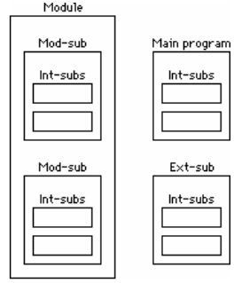

# Subprograms and Modules
- [Function](#function)
  - [General Form](#general-form)
  - [Example: Newton](#example-newton)
  - [The RETURN Statement](#the-return-statement)
- [Subroutine](#subroutine)
- [The Main Program](#the-main-program)
- [External Subprograms](#external-subprograms)
  - [The EXTERNAL Statement](#the-external-statement)
  - [The INTERFACE Block](#the-interface-block)
- [Modules](#modules)
  - [An Example](#an-example)
  - [The USE Statement](#the-use-statement)
  - [PUBLIC and PRIVATE attributes](#public-and-private-attributes)
- [Wrap-up](#wrap-up)
# Function
## General Form
```fortran
FUNCTION Name( [argument list] )
    ! Argument type declared inside
    [declaration statements]
    [executable statements]
END FUNCTION [Name]


FUNCTION K(X)
    INT X       ! Arguments must be declared
    K = X + 1   ! The "return value" 
END FUNCTION K
```
## Example: Newton
```fortran
PROGRAM Newton
! Solves f(x) = 0 by Newton's method
IMPLICIT NONE
INTEGER :: Its = 0      ! Iteration counter
INTEGER :: MaxIts = 20  ! Maximum iterations
LOGICAL :: Converged = .false.
REAL :: Eps = 1e-6      ! Maximum error
REAL :: X = 2           ! Initial value
DO WHILE (.NOT. Converged .AND. Its < MaxIts)
    X = X–F(X) / DF(X)
    PRINT*, X, F(X)
    Its = Its + 1
    Converged = ABS( F(X) ) <= Eps
END DO

IF (Converged) THEN
    PRINT*, 'Newton converged'
ELSE
    PRINT*, 'Newton diverged'
END IF

CONTAINS
    FUNCTION F(X) 
    ! problem is to solve f(x) = 0
        REAL F, X   ! X declared as REAL here
        F = X ** 3 + X – 3   ! F evaluates to this
    END FUNCTION F

    FUNCTION DF(X)
    ! first derivative of f(x)
        REAL DF, X
        DF = 3 * X ** 2 + 1
    END FUNCTION DF

END PROGRAM Newton
```
## The RETURN Statement
- Returns the control to the caller immediately
- Cannot specify a "return value"
- Could result in unstructured code

# Subroutine
- A subroutine can modify its argument(s)
- Subroutine arguments are passed by reference
- A subroutine is invoked with a CALL statement
```fortran
IMPLICIT NONE
REAL A, B
READ*, A, B
CALL SWAP( A, B )
PRINT*, A, B

CONTAINS
    SUBROUTINE SWAP( X, Y )
        REAL Temp, X, Y
        Temp = X
        X = Y
        Y = Temp
    END SUBROUTINE
END
``` 
# The Main Program
Every complete program must have one and only one main program, which has the form
```fortran
PROGRAM name
    [declaration statements]
    [executable statements]

[CONTAINS
internal subprograms]

END [PROGRAM [name]]
```
# External Subprograms
## The EXTERNAL Statement
```fortran
IMPLICIT NONE
EXTERNAL SWAP       ! declaration
REAL A, B
READ*, A, B
CALL SWAP( A, B )
PRINT*, A, B
END


! in a separate file
SUBROUTINE SWAP( X, Y )
    REAL Temp, X, Y
    Temp = X
    X = Y
    Y = Temp
END SUBROUTINE
```
## The INTERFACE Block
An alternative of declaration:
```fortran
IMPLICIT NONE

INTERFACE
    SUBROUTINE SWAP( X, Y )
        REAL X, Y
    END SUBROUTINE
END INTERFACE

REAL A, B
READ*, A, B
CALL SWAP( A, B )
```
# Modules
- A module may contain more than one subprogram
- a module may contain declaration and specification statements which are accessible to all program units which use the module.

## An Example
```fortran
USE MyUtils
IMPLICIT NONE
REAL A, B
READ*, A
B = Pi
CALL SWAP( A, B )
PRINT*, A, B
END


! In a separate file
MODULE MyUtils
REAL, PARAMETER :: Pi = 3.1415927
CONTAINS
    SUBROUTINE SWAP( X, Y )
        REAL Temp, X, Y
        Temp = X
        X = Y
        Y = Temp
    END SUBROUTINE SWAP
END MODULE MyUtils
```
## The USE Statement
```fortran
USE YourMod, MyPlonk => YourPlonk
! General Form: USE module-name, rename-list
! General Form of rename-list: 
! new-name => original-name


USE YourMod, ONLY : X, Y
! allows access to only the entities X and Y of the module. 
! items following the colon may also be renames.
```
## PUBLIC and PRIVATE attributes
```fortran
REAL, PRIVATE :: X
! PRIVATE attribute in declaration

PRIVATE X, SWOP
! PRIVATE specified in a separate statement

PRIVATE
PUBLIC SWOP
! The statement PUBLIC or PRIVATE with no entity resets the default.
! all entities in the module PRIVATE by default
! except for SWOP.
```
# Wrap-up

- Mod-sub: module subprogram
- Int-sub: internal subprogram
- Ext-sub: external subprogram
