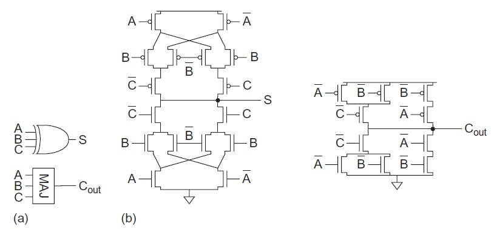
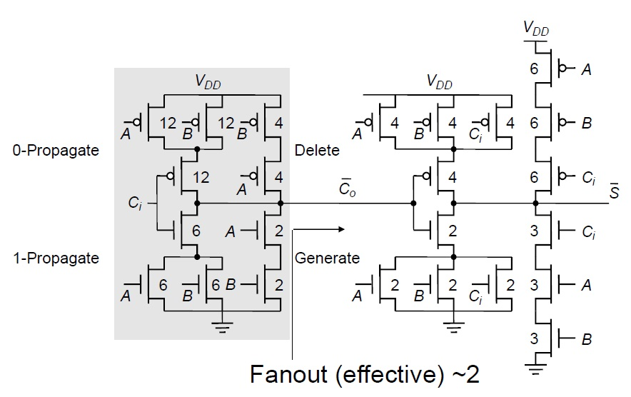
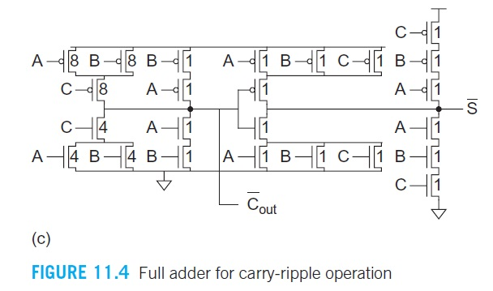

# Mirror Adder
Source: 427 text book p431 

## Benefits
- PMOS network is identical to NMOS network
- Has fewer transistors (24T) than static CMOS (28T)
- $C_{out}$ (Carry out), which is the critical path in carry-ripple adders, has less delay than $S$ (Sum). 
## Design Tips
- Feed the carry-in signal (C) to the inner inputs so the internal capacitance is already discharged when C arrives.
- Make all transistors whose gates are connected to the carry-in and carry logic minimum size. This reduces the cap and delay on the critical path.
- Determine widths of series transistors by analysis and simulation. Build an asymmetric gate that reduces the delay from $C$ to $C_{out}$ at the expense of $S$.
- Use large transistors on the critical path to reduce the fraction of  wiring cap (Not Important).
- Remove the output inverters and alternate positive and negative logic to reduce delay and transistor count to 24 (see Section 11.2.2.1).
## MA: Sample Sizing 1
Source: 427 slides p15 

## MA: Sample Sizing 2
Source: 427 textbook p432 
