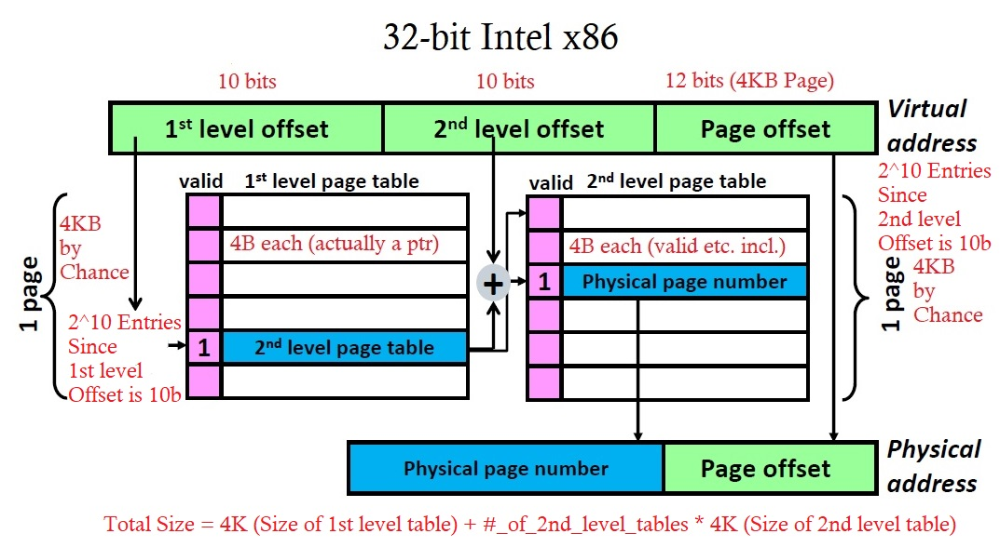

# Virtual Memory
<!-- TOC -->

- [Memory: The Issues](#memory-the-issues)
- [Solutions](#solutions)
    - [Solution 1: User Control](#solution-1-user-control)
    - [Solution 2: Overlays](#solution-2-overlays)
    - [Solution 3: Virtual memory](#solution-3-virtual-memory)
        - [Swap Partition*](#swap-partition)
- [Page Table](#page-table)
    - [Pages](#pages)
    - [Virtual Address Translation](#virtual-address-translation)
    - [Page Faults](#page-faults)
    - [Page Replacement Management*](#page-replacement-management)
- [Hierarchical Page Table](#hierarchical-page-table)
    - [Size of one-level page tables](#size-of-one-level-page-tables)
    - [Size of multi-level page tables](#size-of-multi-level-page-tables)

<!-- /TOC -->
# Memory: The Issues
- Many programs run on a machine
    - Each may require GBs of storage
    - Unrelated programs should not access each other’s storage
- DRAM is too expensive to buy 100 GB, but disk space is not…
    - Our system should work even if it requires more DRAM than we bought.
    - We don’t want a program that works on a 2048-MB-DRAM machine to stop working on a 512-MB machine.
    - To enforce different policies on portions of the memory (e.g.: read-only, etc)
# Solutions
## Solution 1: User Control
- Leave the problem to the programmer
- Programmer must either 
    - make sure the program fits in memory, or
    - break the program up into pieces that do fit and load when necessary
- The hardware design is simple
- PlayStation, engine control unit in a car, etc.
## Solution 2: Overlays
- A little automation to help the programmer
- Two pieces of code/data may be overlayed iff
    - not active at the same time
    - placed in the same memory region
- The compiler manages overlays
    - Good compilers may determine overlay regions
    - Compiler adds code to read the required overlay memory off the
disk when necessary
- The hardware design is still simple (most of the time)
## Solution 3: Virtual memory
Build **hardware and software** that translates each memory reference from a **virtual memory** to a **physical address**
- Virtual Memory
    - the programmer sees as an array of bytes
- Physical Address, either refers to a 
    - DRAM Address, or
    - Location on disk
- **Virtual** in computer architecture means **using a level of indirection**
- Virtual Memory provides programs of
    - Transparency
        - No need to know what other programs are running
    - Protection
        - No program modifies the data of any other program
    - Programs not limited by DRAM capacity
- VM is managed by hardware and software
    - Hardware for speed
    - Software for flexibility: disk controlled by the OS

### Swap Partition*
- How to be not limited by DRAM capacity?
    - Use disk as temporary space in case memory is exhausted
    - swap partition in Linux-based systems

# Page Table


- Page tables are maintained by the OS
- Each process has its own page table
- Contains address translation information i.e., virtual address -> physical address
- Page tables kept in memory by OS, and OS knows the physical address of the page tables
    - No address translation is required for accessing the page tables
    - It is deprecated to view the OS as a set of tables! XD

## Pages
- Page (4KB for x86)
    - Minimum unit of communication between DRAM and disk.
    - Size of physical page = size of virtual page
- A virtual address consists of
    - A virtual page number
    - A page offset field 
        - low order bits of the address
        - not translated

## Virtual Address Translation


- Step 1: The Page table register points to the beginning of the page table (of the process)
- Step 2: look up the page table entry using the virtual page # as the offset
- Step 3: Combine the physical page number with page offset field (not translated) to get the physical address 
## Page Faults

- Virtual Page accesses not found in the DRAM, i.e. the valid bit is 0
- How do we find it on disk?
    - Not a hardware problem


## Page Replacement Management*
- Just like the cache replacement policy
- Least Recently Used (LRU) is too expensive
- One popular policy: clock algorithm
    - Gives the pages "a second chance"
    - The R-bit (Initialized to 1)
    - When page replacement needed (i.e. a page fault occurs), see following pseudo-code
```cpp
// Pseudo-code of the clock algorithm

catch (page_fault){ // when a page fault occurs

    while (true){
        if (hand->r_bit == 1){
            // if the page pointed to by the hand has an R-bit of 1
            
            // set the r-bit to 0, i.e. give it a second chance
            hand->r_bit = 0; 

            // forward the hand
            ++hand;
            
        }
        else {
            // if the page pointed to by the hand has an R-bit of 1
            // i.e. this is the second time it's pointed to by hand
            
            // overwrite this page
            hand->data = load_page();

            // initialize the R-bit with 1
            hand->r_bit = 1;

            // done
            ++hand;
            break;
        }
        
    }
    
}
```


# Hierarchical Page Table
## Size of one-level page tables
</br>

```
Remark: Unless specified otherwise

    NUM_OF_Page_Entries_in_Page_Table = 2 ^ NUM_OF_Virtual_Page_#_BITS
```
- ~3MB for an one-level page table (for each process)!
- Solution: Using a multi-level page table
## Size of multi-level page tables
</br>
- What is the least amount of memory that could be used? When would this happen?
    - 4KB for 1st level page table only
    - Occurs when no memory has been accessed (before program runs)
- What is the most memory that could be used? When would this happen?
    - 4KB for 1st level page table + 2^10 * 4KB for all possible 2nd level page tables
    - 4100KB (which slightly greater than 4096KB)
    - Occurs when program uses all virtual pages ( 2^(10 + 10) pages )