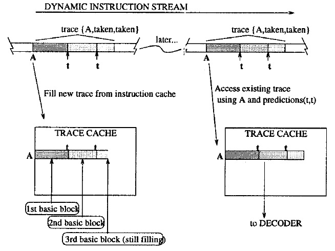

<!-- TOC -->

- [Trace Cache](#trace-cache)
    - [Overview](#overview)
    - [Structure](#structure)
        - [Line-fill buffer logic](#line-fill-buffer-logic)

<!-- /TOC -->

# Trace Cache
**Trace Cache** is a special instruction cache which captures dynamic instruction sequences. This structure is called a **trace cache** because each line stores a snapshot, or trace, of the dynamic instruction stream. A **trace cache** is capable of fetching past multiple, possibly taken branches each cycle, without increasing fetch unit latency.

## Overview
A **trace** is fully specified by a **starting address** and a sequence of **branch outcomes**.

Fig. 1: High level view of the trace cache.

If the same **trace** is encountered again in the course of executing the progrm, i.e. the same starting address and predicted branch outcomes, it will be available in the **trace cache** and is fed directly to the decoder.  
Otherwise, fetching proceeds normally from the instruction cache.

## Structure
A **trace cache** is made up of **instruction traces**, **control information**, and **line-fill buffer logic**. 
The length of a trace is limited in two ways:
1. By number of instructions n, chosen based on the peak dispatch rate.
2. By number of basic blocks m, chosen based on n and the average number of instructions in a basic block.

The **control information** is similar to the tag array of standard caches but contains additional state information:
- valid bit: indicates this is a valid trace.
- tag: identifies the starting address of the trace.
- branch flags: One single bit for each branch **within the trace** (taken/not taken). The mth branch of the trace does not need a flag since no instructions follow it, hence there are only m - 1 bits instead of m bits.
- branch mask: (1) # of branches in the trace (2) whether the trace ends in a branch. 
- trace fall-through address: next fetch address if the last branch in the trace is predicted not taken.
- trace target address: next fetch address if the last branch in the trace is predicted taken.

### Line-fill buffer logic

