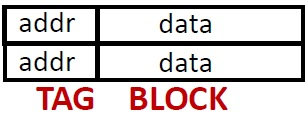
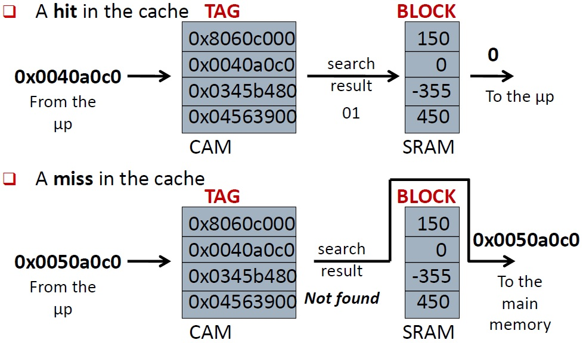
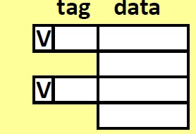
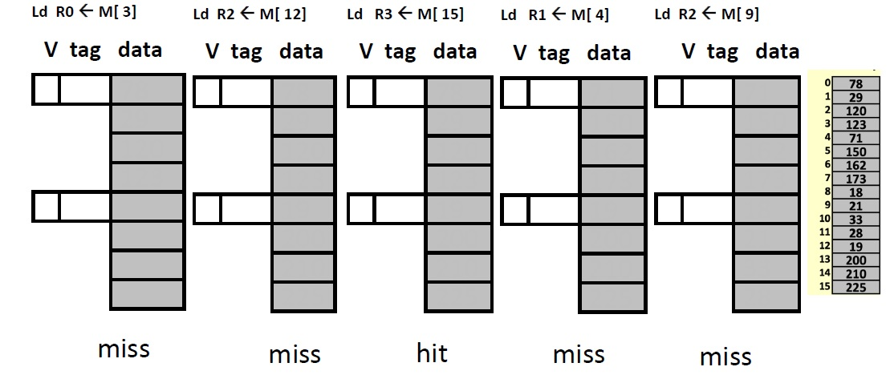
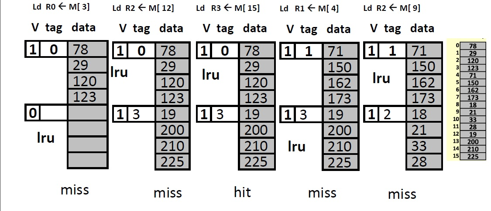
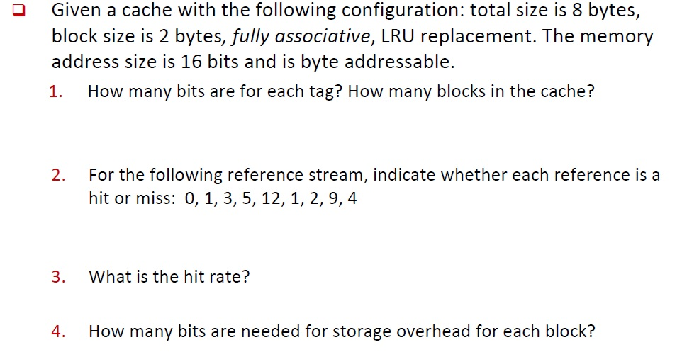
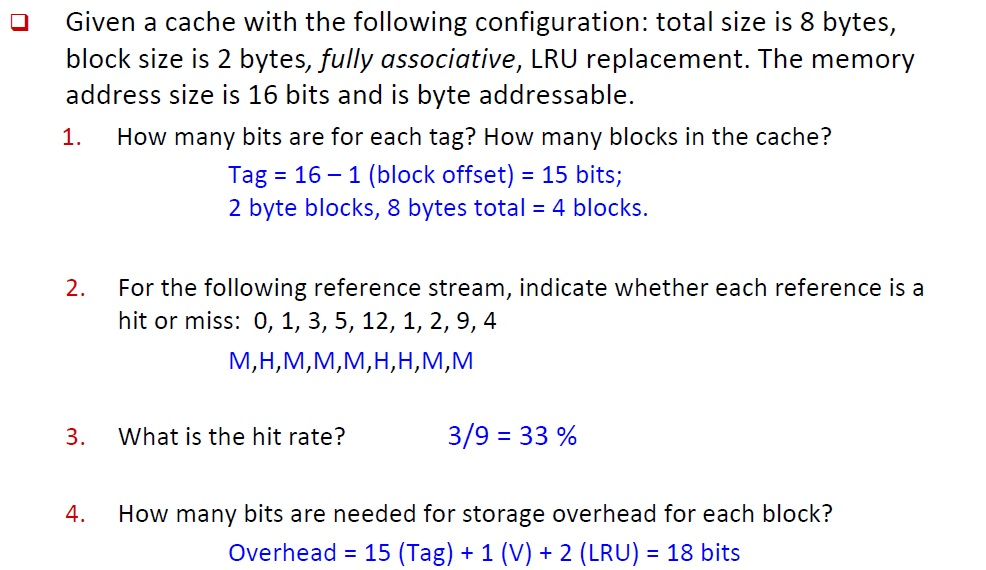
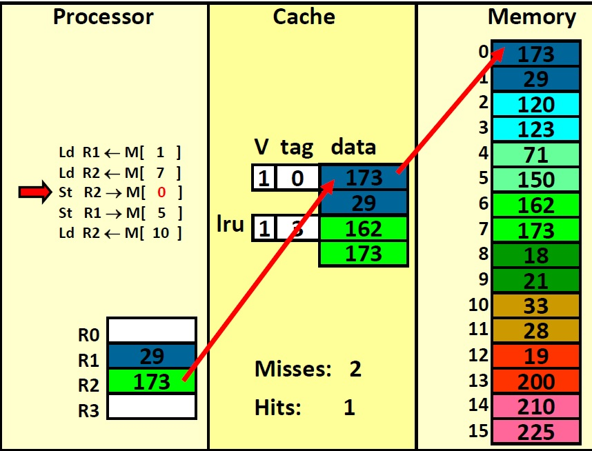
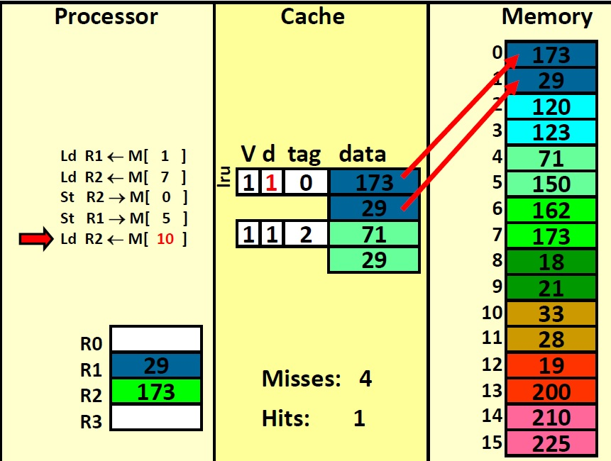

# Cache
<!-- TOC -->

- [Cache Memory](#cache-memory)
- [Content Addressable Memories (CAM)](#content-addressable-memories-cam)
    - [CAM method "search"](#cam-method-search)
    - [CAM method "write"](#cam-method-write)
- [Cache Organization: Load](#cache-organization-load)
    - [Terminology](#terminology)
        - [cache line](#cache-line)
        - [hit/miss](#hitmiss)
    - [The Principle of Temporal Locality](#the-principle-of-temporal-locality)
    - [The Least Recent Used (LRU) Replacement Policy](#the-least-recent-used-lru-replacement-policy)
    - [The Principle of Spatial Locality](#the-principle-of-spatial-locality)
    - [Caching a block](#caching-a-block)
    - [Practice Problem 1](#practice-problem-1)
    - [Practice Problem 2](#practice-problem-2)
- [Cache Organization: Store](#cache-organization-store)
    - [Write-through Policy](#write-through-policy)
    - [Write-back Policy](#write-back-policy)
    - [Allocate-on-write Policy](#allocate-on-write-policy)
    - [No Allocate-on-write Policy](#no-allocate-on-write-policy)

<!-- /TOC -->

An analogy: studying books in library
- 3 open books on the desk (SRAM, Cache)
    - latency: 10 sec
- 10 closed books on the desk (DRAM, Main Memory)
    - latency: 1 min
- books on the shelves (Disk)
    - latency: 10 min
# Cache Memory
Cache memory can copy data from any part of main memory. It has 2 parts:
- The TAG (content addressable memory, CAM) holds the memory address
- The BLOCK (SRAM) holds the memory data

 
# Content Addressable Memories (CAM)
Memory receives a **key**.  
Returns whether the key exists. If the key exists, also returning the associated value.  
Similar behaviour to a hash table.
## CAM method "search"
- Send data to CAM
- Return "found" or "not found"
- If found, return associated value

## CAM method "write"
Send data to CAM to store 
Where should it be stored if CAM is full? 
- Replacement policy
    - Replace oldest data in the CAM
    - Replace least recently searched data

# Cache Organization: Load
## Terminology
### cache line
A cache memory consists of multiple tag/block pairs (called **cache lines**) 
Remarks:
- Searches done in parallel
- At most one tag will match
### hit/miss
If there is a tag match, it is a cache **hit**. 
If there is no tag match, it is a cache **miss**.
Every cache miss will get the data from memory and store it in a cache line. 
Which cache line to overwrite?

 
## The Principle of Temporal Locality
If you access a memory location (e.g., 1000) you will be more likely to re-access that location than you will be to reference some other random location.
## The Least Recent Used (LRU) Replacement Policy
Always overwrite the least recent used (LRU) cache line. 
Problem: Expensive to implement. 
Approximation:
- A random block
- A random block if it is not the most recently used (NMRU)

Another Solution: **Cache bigger units than bytes**
## The Principle of Spatial Locality
Spatial locality in a program says that if we reference a memory location (e.g., 1000), we are more likely to reference a location near it (e.g. 1001) than some random location.

## Caching a block
 
"V" is the valid bit.
## Practice Problem 1

## Practice Problem 2

# Cache Organization: Store
- When Hit
    - Send it to the cache.
    - Should we also send it to memory?
        - Yes: **write-through policy**
        - No: **write-back policy**
- When Miss
    - Allocate the line (put it in the cache): **allocate-on-write policy**
    - Write it directly to memory without allocation: **no allocate-on-write policy**
## Write-through Policy

## Write-back Policy
- Keep the most recent copy in the cache and update the memory only when that data is evicted from the cache
- Do we need to write-back all evicted lines?
    - No, only blocks that have been stored into
    - Keep a “dirty bit”, reset when the line is allocated, set when the block is stored into. If a block is “dirty” when evicted, write its data back into memory.

## Allocate-on-write Policy
When the address to be written to is not in cache, 
- Load it into the cache.
- Then write to it.
- Write back to memory if write-through is applied.
- Set the dirty bit if write-back is applied.
## No Allocate-on-write Policy
When the address to be written to is not in cache, 
- Do not load it into the cache.
- Write directly into memory.