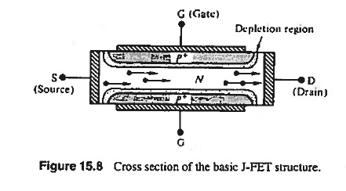
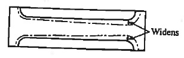
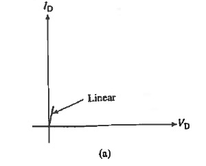
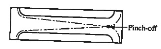
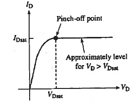

# FET
<!-- TOC -->

- [JFET (Junction FET)](#jfet-junction-fet)
    - [I-V Characteristics](#i-v-characteristics)
        - [Questions](#questions)
    - [Pinch-off voltage](#pinch-off-voltage)
    - [Channel Current](#channel-current)
    - [Gain (Transconductance)](#gain-transconductance)
- [MESFET (Metal Semiconductor FET)](#mesfet-metal-semiconductor-fet)
- [MOSFET (Metal-Oxide FET)](#mosfet-metal-oxide-fet)

<!-- /TOC -->
# JFET (Junction FET)
 
Suppose we connect **S** to ground, reverse bias at **S** is $V_G$. 
## I-V Characteristics
1. $V_G$ = 0. When VD is small, ID is small. Linear I-V. No change in depletion width across channel. 
 
 
2. $V_G$ increases. Channel pinches-off. 
 
 
 
### Questions
1. Should/Should not $I_D$ = 0 beyond pinch-off? 
No. Carriers can also pass depletion region, but see a much higher resisitance.
2. Why does $V_D$ > $V_D^{Sat}$ have no effect on ID? 
Increasing $V_D$ will also increase the length of pinched-off region. These two effects cancel out.
## Pinch-off voltage
$V_p$ = Reverse bias between n-channel and $p^+$ gate at the drain end $(x=0)$. 
$h(x)$ = Channel half-width at any $x$ 
$a$ = half width of channel 
Assumptions:
1. Channel with at $x=0$ decreases uniformly as the reverse bias increases to pinch-off.
2. $V_{bi}$ neglected.
3. $p^+-n$ gate junction.

> $$V_p=\frac{qa^2N_D}{2\varepsilon}$$
$a$: half thickness
## Channel Current
$L$: length 
$Z$: depth 
$2a$: thickness
> $$I_D=G_oV_P\left[\frac{V_D}{V_P} + \frac23\left(-\frac{V_G}{V_P}\right)^{3/2} - \frac23\left(\frac{V_D-V_G}{V_P}\right)^{3/2}\right]$$
> $$G_o=\frac{2aZ}{\rho L}$$
> $$I_D(sat)=G_oV_P\left[\frac{V_D}{V_P} + \frac23\left(-\frac{V_G}{V_P}\right)^{3/2} - \frac23\right]$$
## Gain (Transconductance)
> $$g_m(sat)=\frac{\partial I_D(sat)}{\partial V_G}=G_o\left[1-\left(-\frac{V_G}{V_P}\right)^{1/2}\right]$$
# MESFET (Metal Semiconductor FET)

# MOSFET (Metal-Oxide FET)