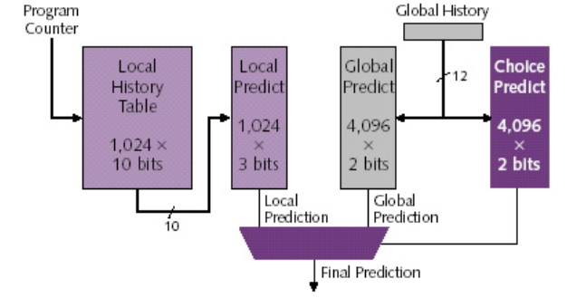

# Pipeline Control Hazards & Branch Prediction
<!-- TOC -->

- [Pipeline Hazards](#pipeline-hazards)
- [Control Hazards](#control-hazards)
    - [Detect and stall](#detect-and-stall)
    - [Speculate and Squash-if-Wrong](#speculate-and-squash-if-wrong)
- [Branch Prediction](#branch-prediction)
    - [Static (Compile-time) Prediction](#static-compile-time-prediction)
        - [Always not-taken](#always-not-taken)
        - [Always taken](#always-taken)
        - [Backward taken, forward not taken (BTFN)](#backward-taken-forward-not-taken-btfn)
    - [Dynamic Prediction](#dynamic-prediction)
        - [Last time predictor](#last-time-predictor)
        - [Two-Bit Counter Based Prediction](#two-bit-counter-based-prediction)
        - [Two Level Global Branch Prediction](#two-level-global-branch-prediction)
        - [Two Level Local Branch Prediction](#two-level-local-branch-prediction)
        - [Alpha 21264 Tournament Predictor (just for fun)](#alpha-21264-tournament-predictor-just-for-fun)

<!-- /TOC -->
# Pipeline Hazards
What can go wrong in pipelining?
- Data Hazards: Wrong data read before data is written.
- Control Hazards: Wrong instruction fetched before a taken branch.
- Exceptions
# Control Hazards
## Detect and stall
Delay fetch until branch resolved.
- Detection:
    - Must wait until decode (otherwise no way to tell whether it's a branch/jump).
    - Compare opcode to beq or jalr.
- Stall:
    - Keep current instructions in fetch. (IF/ID reg & pc remain unchanged)
    - Pass noop to **decode** stage, not execute! (This is because the detection happens at decode)
    
Problem: CPI increases every time a branch is detected!

## Speculate and Squash-if-Wrong
- Speculate: Assume branch not taken
    - Keep fetching from PC+1 until we know that the branch is really taken.
- Squash: flush bad instructions if branch taken
    - Overwrite Decode, Execute, and Memory with a noop (these instructions are bad).
    - Send target address of the taken beq to PC (the correct fetch address for the next instruction).

Problem: CPI increases every time a branch is taken (About 50%-66% of time)! 
Remarks: more branches are taken because Backward branches (i.e. loop branches) are usually taken. The OS itself is a big loop.

# Branch Prediction
## Static (Compile-time) Prediction
### Always not-taken
Simple to implement: no need for BTB, no direction prediction 
Low accuracy: ~30-40% 
### Always taken
Better accuracy: ~60-70% 
Backward branches (i.e. loop branches) are usually taken
### Backward taken, forward not taken (BTFN)
Predict backward (loop) branches as taken, others not-taken
## Dynamic Prediction
Uses information dynamically stored in Branch Target Buffer (BTB) (also called Branch Target Address Cache).
### Last time predictor
Single bit per branch (stored in BTB) 
Indicates which direction branch went last time it executed 

Problem: changes its prediction from T->NT or NT->T too quickly.  
e.g. TNTNTNTNTNTNTNTNTNTN -> 0% accuracy
### Two-Bit Counter Based Prediction

### Two Level Global Branch Prediction
A branch’s outcome can be correlated with other branches’ outcomes
- First level: Global branch history register (N bits)
    - The direction of last N branches (taken/not taken)
    - Acts as the fingerprint of each branch
- Second level: Pattern History Table (PHT)
    - A cache accessed by the direction of past N branches (e.g. taken, not taken, taken, not taken, ...)
    - Inside the table: "strongly taken", "weakly taken", "weakly !taken", "strongly !taken" (see two-bit counter based prediction)

### Two Level Local Branch Prediction
A branch’s outcome can be correlated with past outcomes of the same branch (other than the outcome of the branch “last-time” it was executed)

- First level: A set of local history registers (N bits each)
    - Select the history register based on the PC of the branch
    - Involves mapping from PC to the local history regs
- Second level: Pattern History Table (PHT)
    - The direction the branch took the last time the same history was seen
    - All local history registers share this table

### Alpha 21264 Tournament Predictor (just for fun)

- Global Branch Prediction Unit
- Local Branch Prediction Unit
- Choice Prediction Unit
    - Another predictor that predicts "whether global/local prediction should be used"
    - The reason why it's called a "tournament predictor"
