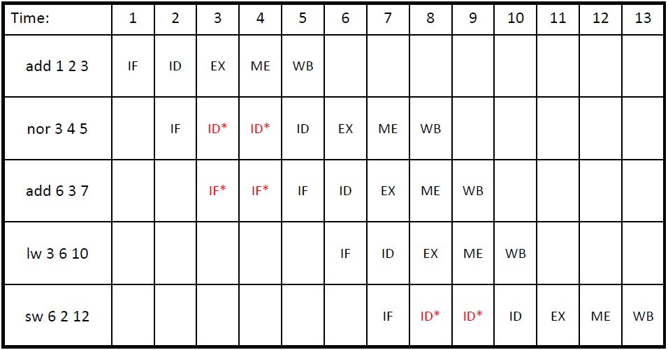
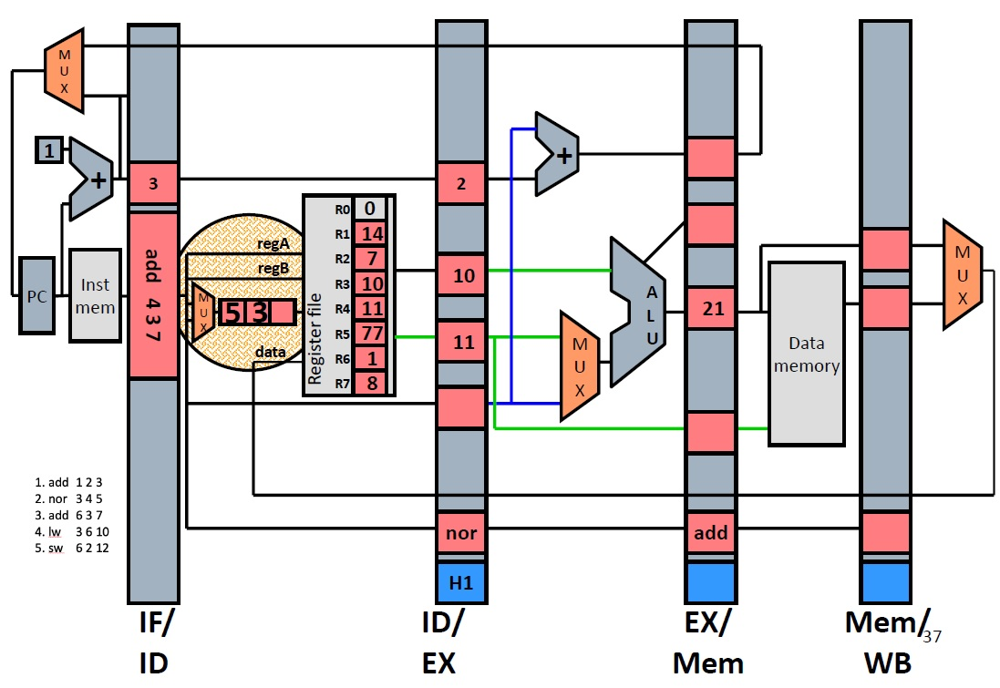
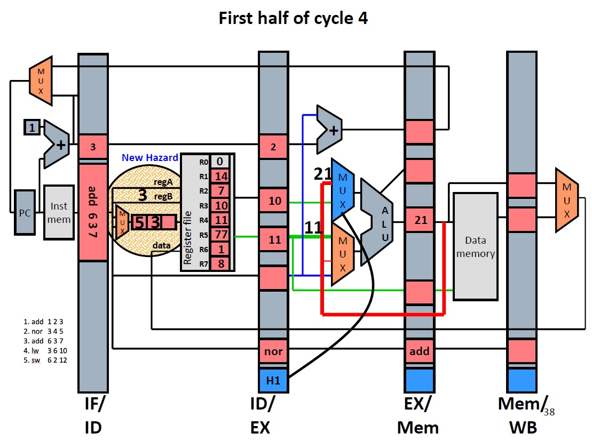
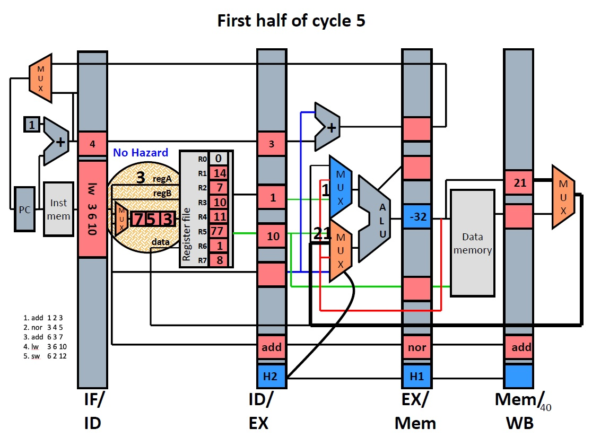
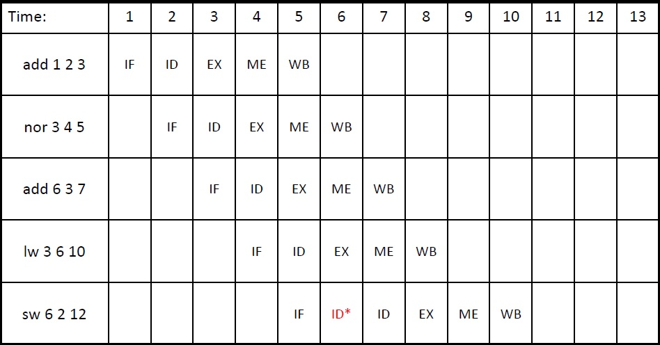

# Pipeline Data Hazards
<!-- TOC -->

- [Pipeline Hazards](#pipeline-hazards)
- [Data Hazards](#data-hazards)
    - [Detect and Stall](#detect-and-stall)
    - [Detect and Forward](#detect-and-forward)

<!-- /TOC -->
# Pipeline Hazards
What can go wrong in pipelining?
- Data Hazards: Wrong data read before data is written.
- Control Hazards: Wrong instruction fetched before a taken branch.
- Exceptions
# Data Hazards
read-after-write (RAW) dependences
```
add 1 2 3    //writes reg 3
nor 3 4 5    //reads reg 3
```
Two possible solutions.
## Detect and Stall
If hazards exist, stall the processor until they go away.
- Detect: Compare regA & regB with previous DestRegs
- Stall:
    - Keep current instructions in fetch and decode (IF/ID reg & pc unchanged)
    - Pass a noop to **execute**
    
</br>
<center>Time table for Detect-and-Stall.</center>
Problem: CPI increases every time a hazard is detected!

## Detect and Forward
- Detect: same as detect and stall
    - Except that all 4 hazards are treated differently
- Forward:
    - New **bypass datapaths** route computed data to where it is needed
    - New MUX and control to pick the right data
- Stall: may still be required even in the presence of forwarding

For the following datapath:</br>
</br>
No need to stall for add/nor type RAW dependences.</br>
ALU result ("21" in the figure below) can be fed directly to ALU input.</br>
</br>
"21" can also be forwarded from other locations. </br>
</br>
Note that we still have to stall for one type of hazard: a lw followed by an instruction that uses the register being loaded. This is because the data will not be ready for forwarding before the memory operation (MEM) stage.</br>
Still, we pass a noop to the **execution stage**.</br>
</br>
<center>Time table for Detect-and-Forwarding.</center>

